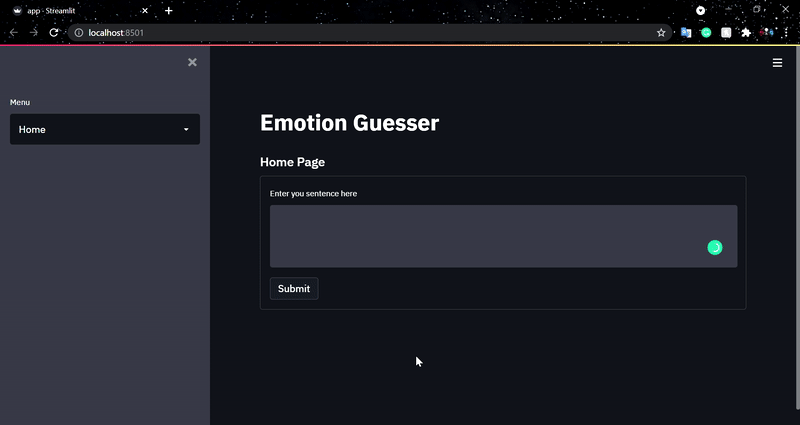

# EmotionDetectionApp

EDA using Streamlit

## Models

-   Unzip the Models.7z folder inside Models Directory

## To Start the app

-   `pip3 install streamlit` 
-   `streamlit run app.py`

## Example

